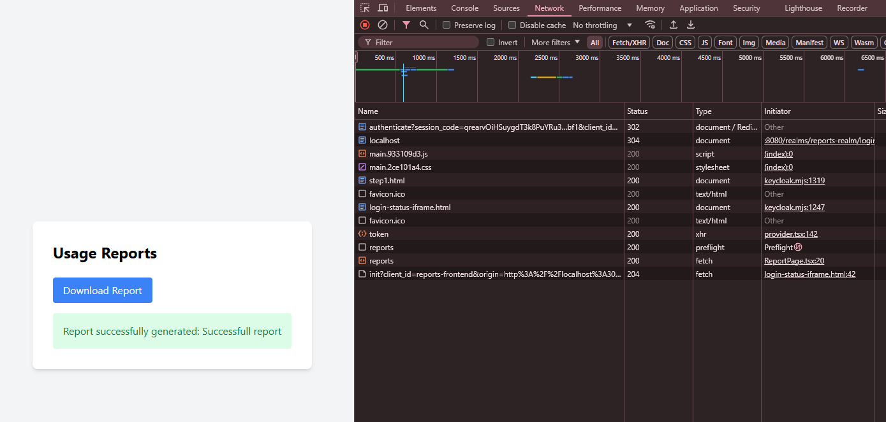

Чтобы запустить проект необходимо сначала локально собрать проект API (бэк энд), т.к. при использовании многоуровнего докера была проблема с допуском к репозиторию мавен.
mvn clean package -DskipTests

Далее из корня проекта запускаем docker compose:
docker-compose up -d --build

