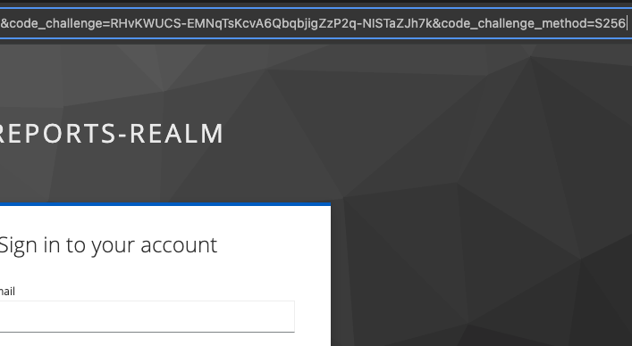

# HW8 - что сделано

## Задание 1

Для того, чтобы повысить безопасность включено PKCE, который реализует проверяет  отправленный на шаге получения кода авторизации отправляет также хэш от `code_verifier`, который передается в параметре `code_challenge`.

1. Добавил для клиента фронта (в keycloak) параметры `pkce.code.challenge.method` и `pkce.enabled`. Использована хэш-функция S256. Тоже самое можно сделать в UI.
2. В главном модуле фронта `App.tsx` добавил атрибут в `initOptions` указывающий тип хэш-функции при вызове keycloak провайдера.
3. Итого видим в URL нужный параметр:

## Задание 2

1. `docker-compose.yaml` дополнил сервисом для api, прокинул переменные окружения для доступа в keycloak
2. Создал Dockerfile для python приложения, запускается на порту 8000 
3. В `auth.py` реализовал обрашение к realm с получением публичного ключа для проверки токена. Если токен валидные - возвращает список ролей. Иначе код ошибки.
4. `app.py` реализует логику эндпоинта `/reports`, парсит токен из заголовка проверяет роли и возвращает соответствующие ошибки (401 - ошибки валидации токена, 403 - нет нужной роли)

Небольшой пруф, что работает. Сначала user1 - код 403, потом prothetic1 - код 200:

