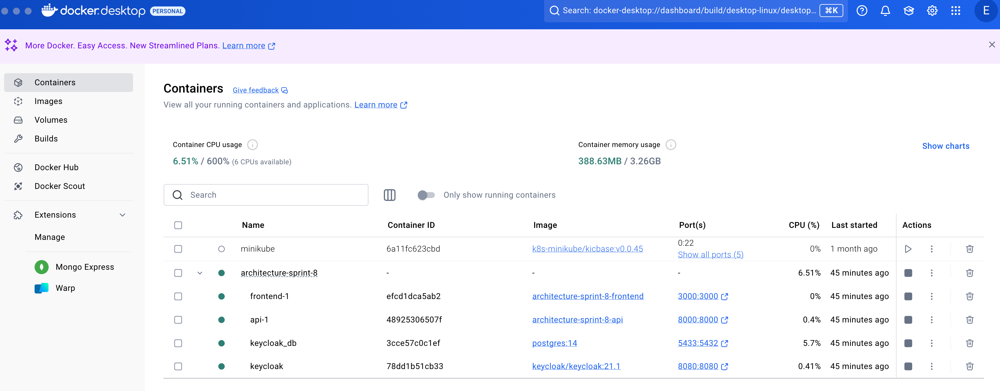
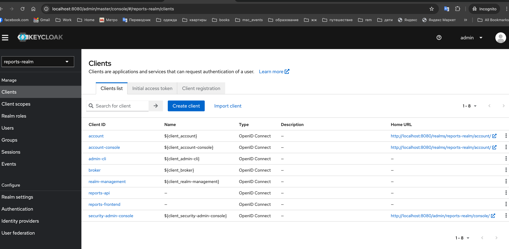
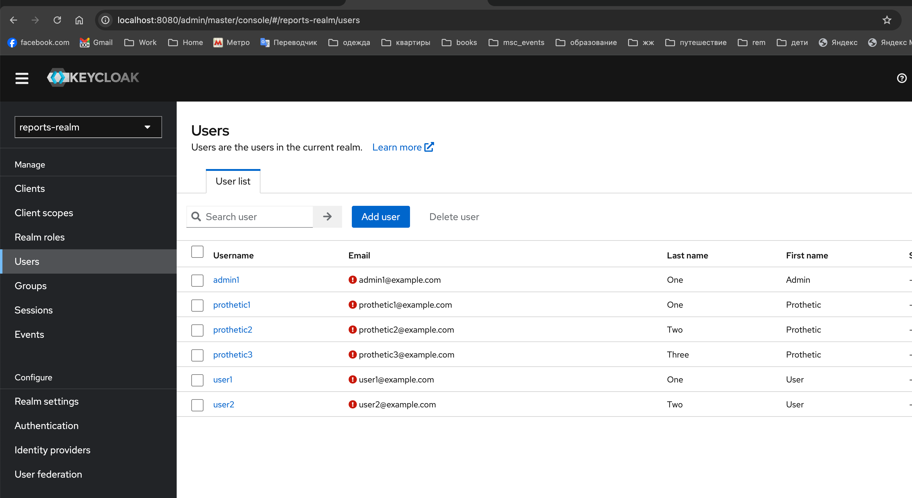
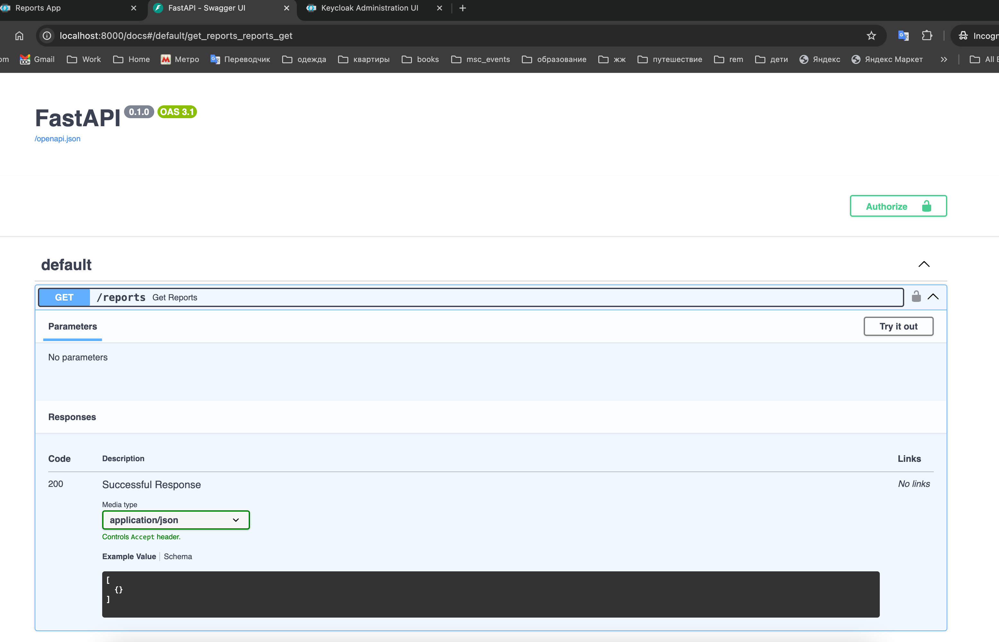
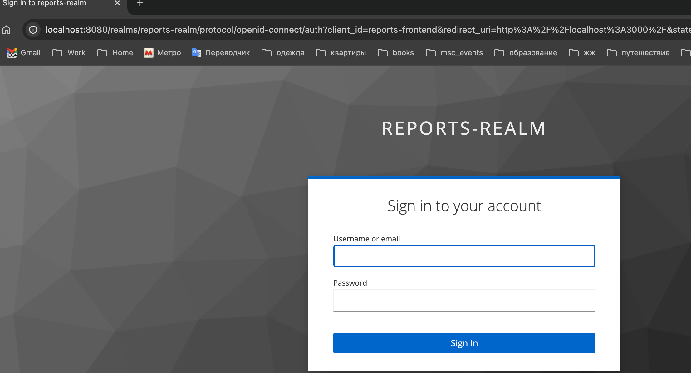
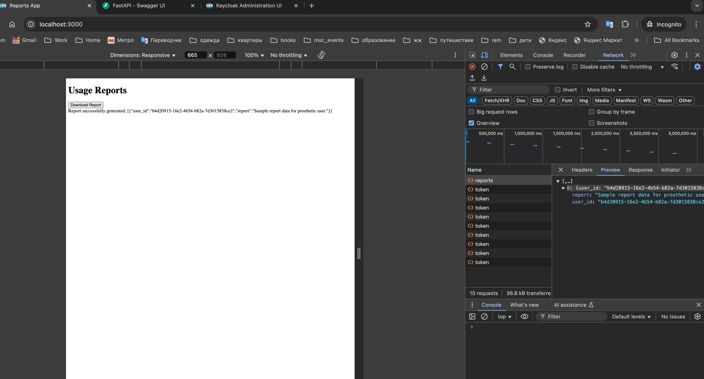
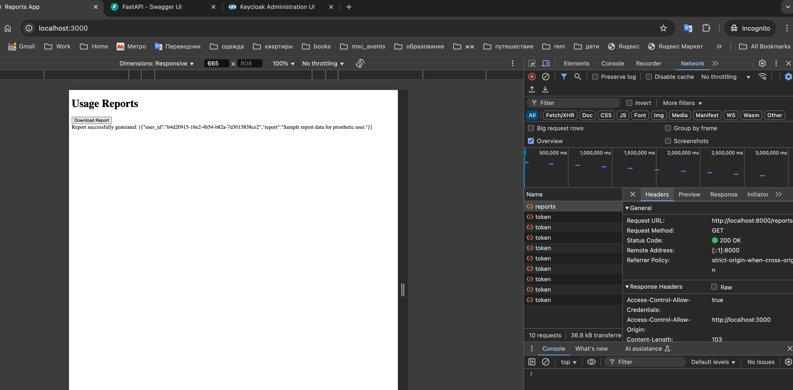
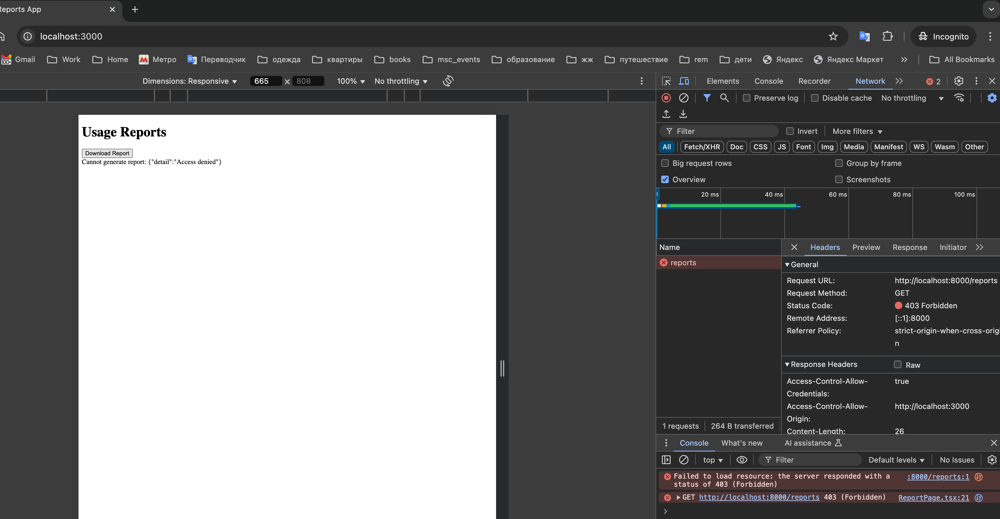

# Как запустить приложение - проверка api c keycloak

## Запуск тестового примера

## Как запустить (на IDEA for Mac)

Запускаем скрипт

```shell
chmod +x scripts/testapp_running.sh
scripts/testapp_running.sh
```

# 📌 Описание приложения

## 🏗 Архитектура
Приложение состоит из **фронтенд-части на React** и **бэкенд-части на FastAPI** (Python).  
Для аутентификации и авторизации используется **Keycloak**.

---

## 🚀 Основные шаги для проверки работы приложения

### 🔹 1. Запуск Keycloak
Убедитесь, что Keycloak и его база данных запущены.  
Для этого выполните команду:

```sh
docker-compose up keycloak_db keycloak
```

---

### 🔹 2. Запуск бэкенда (FastAPI)
FastAPI не требует сборки, так как используется интерпретируемый Python.  
Однако, можно проверить API с помощью **тестов на Java** (`ApiClientTest`).

#### ✅ Создание Docker-образа для API:
```sh
docker build -t reports-api api/
```

#### ✅ Запуск API:
```sh
docker-compose up api
```

---

### 🔹 3. Запуск фронтенда (React)
Запустите фронтенд-приложение командой:

```sh
docker-compose up frontend
```

---

## ✅ Проверка работы приложения

### 1️⃣ Открытие фронтенда
Откройте браузер и перейдите по адресу:

```
http://localhost:3000
```

При входе в систему вы будете перенаправлены на страницу **Keycloak** для аутентификации.

---

### 2️⃣ Вход в систему (Keycloak)
Используйте учетные данные из `keycloak/realm-export.json`.

| Роль                        | Логин        | Пароль        |
|-----------------------------|-------------|--------------|
| 👤 Обычный пользователь      | `user1`     | `password123` |
| 🔧 Администратор            | `admin1`    | `admin123`    |
| 🦾 Протетический пользователь | `prothetic1` | `prothetic123` |

---

### 3️⃣ Проверка функциональности ролей

#### 🔹 Вход под разными пользователями
- Войдите под **разными учетными записями** (`user1`, `admin1`, `prothetic1`).
- Убедитесь, что **каждый пользователь видит только те разделы**, которые соответствуют его роли.

#### 🔹 Проверка доступа к API
- Используйте **`ApiClientTest`** для проверки доступа к API.
- Проверьте, что пользователи с разными ролями имеют **разные уровни доступа**.

#### 🔹 Проверка отображения данных
- Убедитесь, что данные на фронтенде соответствуют ролям.
- Например, **администратор должен видеть больше данных** и иметь больше возможностей, чем обычный пользователь.

---

## 🔹 4. Проверка доступа к API с помощью `ApiClientTest`

1. Откройте **Java-класс** `ApiClientTest`.
2. Запустите его, чтобы выполнить запрос к API.
3. Проверьте, что **неавторизованные пользователи получают `401 Unauthorized`**, а авторизованные – `200 OK`.
4. Убедитесь, что **ответ содержит корректные данные**.

Пример лога успешного ответа:
```
Response: {"user_id": "12345", "report": "Sample report data for prosthetic user."}
```

---

## 🛠 Полезные команды

### 📌 Перезапуск всех сервисов:
```sh
docker-compose down && docker-compose up --build
```

### 📌 Проверка логов API:
```sh
docker logs -f reports-api
```

### 📌 Проверка логов Keycloak:
```sh
docker logs -f keycloak
```

---

## 🔗 Ссылки (работа приложения)
- **Фронтенд**: [http://localhost:3000](http://localhost:3000)
- **Keycloak**: [http://localhost:8080](http://localhost:8080)
- **Swagger-документация API**: [http://localhost:8000/docs](http://localhost:8000/docs)

🚀 **Теперь вы готовы протестировать приложение!** 🎉

## 📌 Скриншоты (работа приложения)

## docker



## keycloak





## api



## app







для пользователя user1




