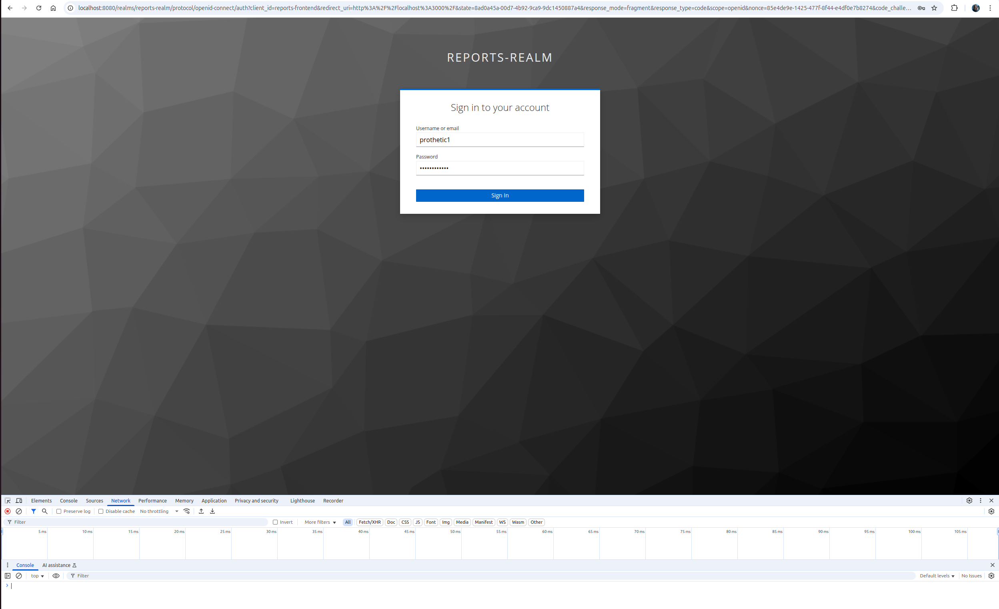
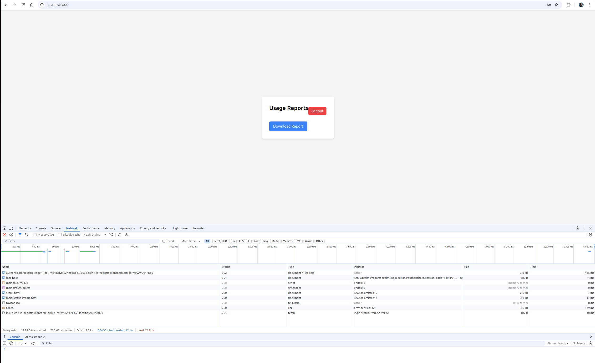
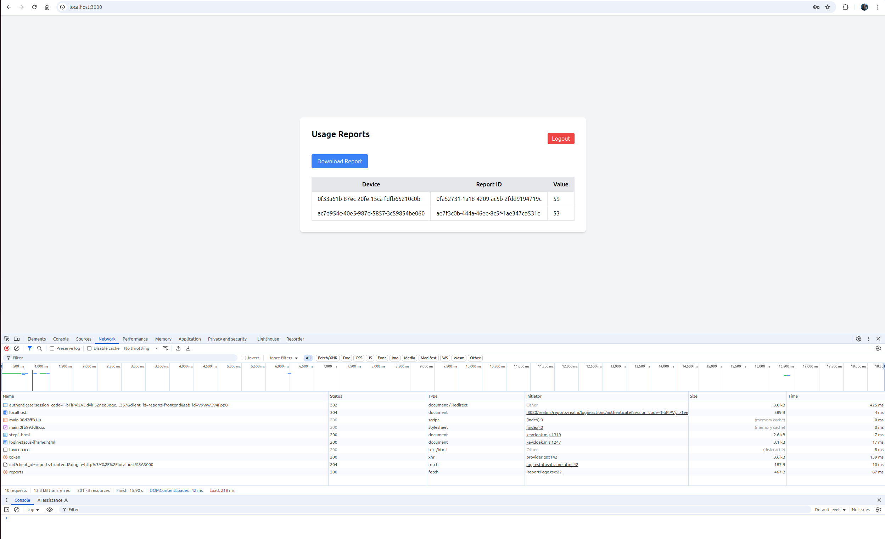
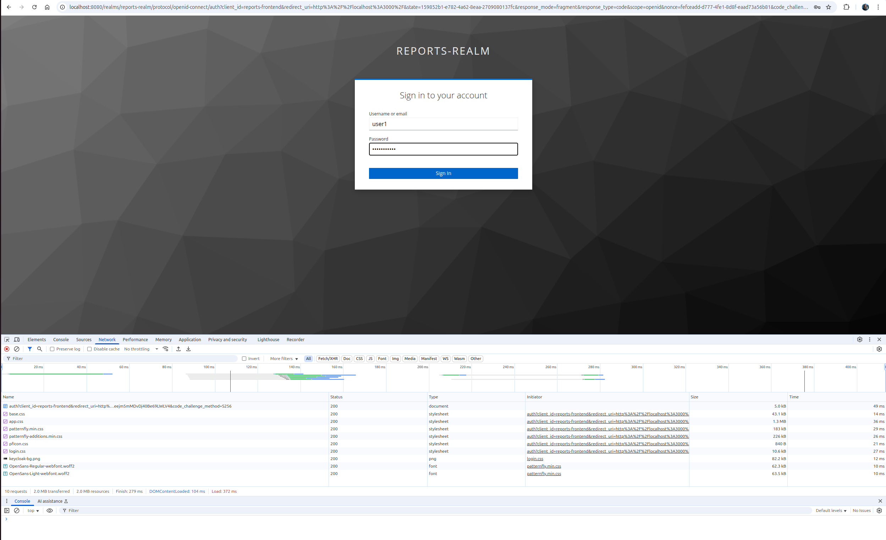
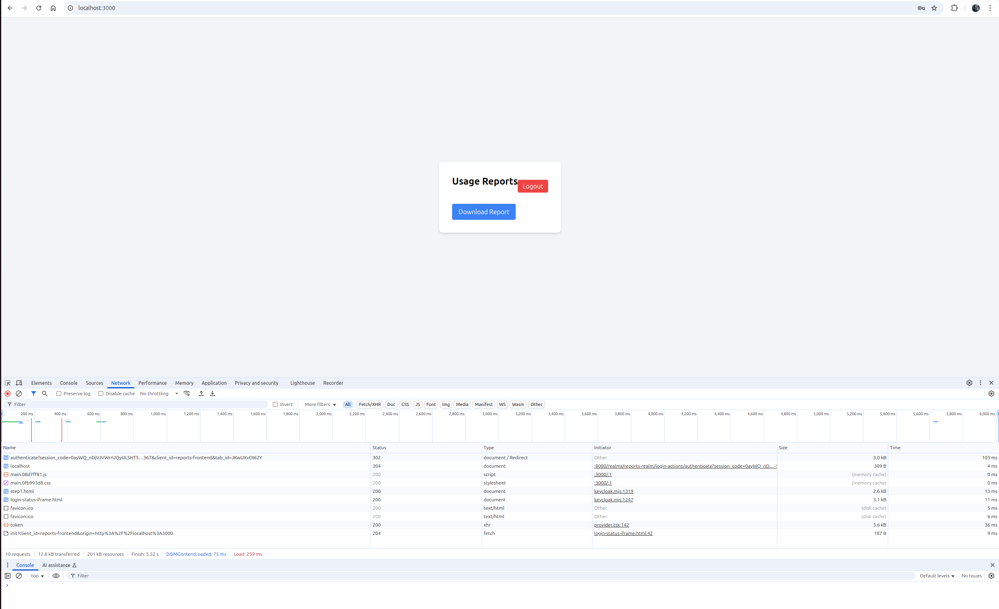
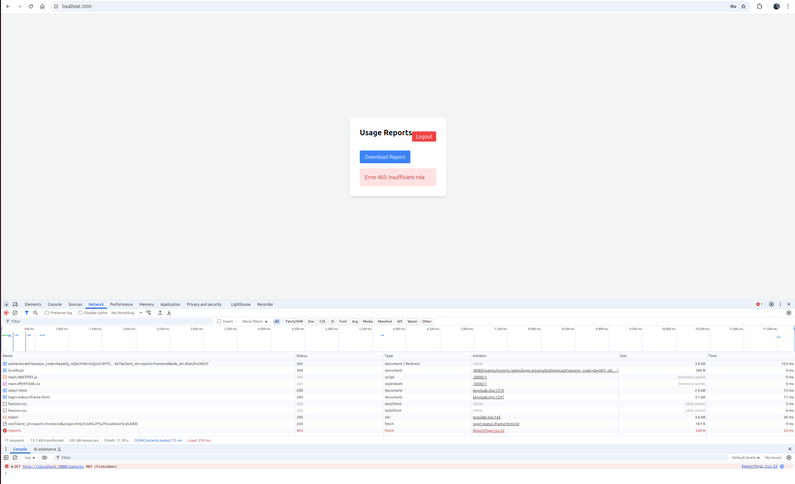

1. Произведём запуск:
```bash
sudo docker-compose up --build
```

2. Перейдём в браузере по url:  http://localhost:3000

3. Введём логин и пароль для пользователя `prothetic1`


4. После корректного ввода логин с паролем произойдёт переход на страницу запроса отчёта.


5. Нажмём на кнопку `Download Report` (данный пользователь имеет необходимую для доступа к отчёту роль `prothetic_user`)
 
 Сгенерированный отчёт успешно отобразился.
 
 6. Нажмём `Logout`, чтобы разлогиниться и произвести проверку доступа ещё одного пользователя.

 7.  Введём логин и пароль для пользователя `user1`


8. После корректного ввода логин с паролем произойдёт переход на страницу запроса отчёта.


9. Нажмём на кнопку `Download Report` (данный пользователь имеет роль `user` и НЕ имеет доступа к /reports)


Пользователь аутентифицирован, но не имеет роли prothetic_user. Поэтому отбразилась ошибка `403: Insufficient role`

Все запуски отработали корректно! =)